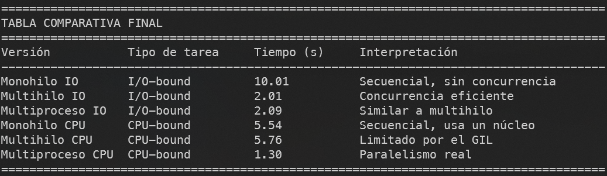
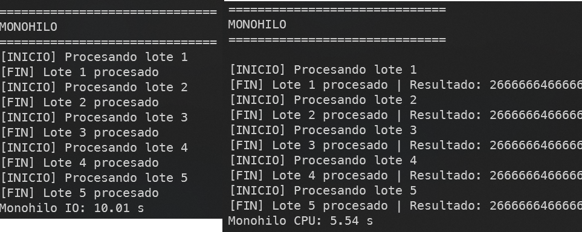
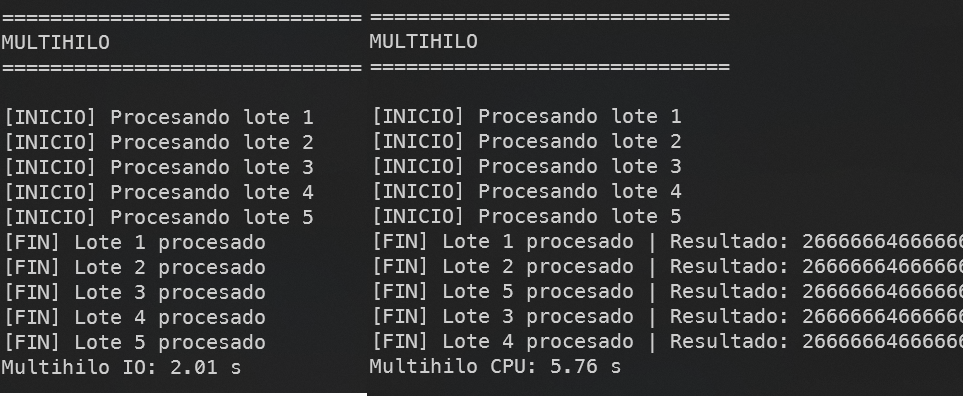
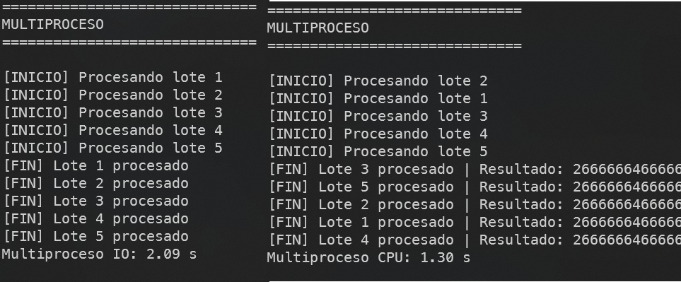

# Explorando la Concurrencia y el Paralelismo: Procesos y Hilos

## Analisis de resultados

Por Luis Giner Tendero


## 1. Justificación de la simulación CPU-bound

En la primera versión del ejercicio, el procesamiento de los lotes de datos se simula mediante la función `time.sleep()`. Este tipo de tareas se consideran **I/O-bound**, ya que el programa pasa la mayor parte del tiempo esperando (bloqueado) en lugar de realizar cálculos.

Sin embargo, este enfoque no permite observar correctamente las diferencias entre multihilo y multiproceso en escenarios reales, ya que durante la espera (`sleep`) la CPU queda libre y puede ser utilizada por otros hilos.

Por este motivo, se ha implementado una segunda versión del programa basada en tareas **CPU-bound**, es decir, tareas que requieren uso intensivo del procesador. Esto permite analizar de forma más realista el comportamiento de:

- ejecución secuencial
- concurrencia mediante hilos
- paralelismo mediante procesos

---

### Implementación de la carga de trabajo

Para simular una carga de CPU, se ha utilizado un bucle de cálculo intensivo:

```python
resultado = 0
for i in range(carga_trabajo):
    resultado += i * i
```

Este tipo de operación:

- no depende de entrada/salida
- utiliza la CPU constantemente
permite observar el impacto del GIL en Python

---

### Objetivo de esta comparación

El uso de ambas versiones (I/O-bound y CPU-bound) permite demostrar que:

- el multihilo es eficiente cuando hay tiempos de espera
- el multiproceso es necesario para aprovechar múltiples núcleos en tareas de cálculo

---

## 2. Comparación de tiempos de ejecución

A continuación se muestran los tiempos obtenidos tras ejecutar las diferentes versiones del programa:

| Modelo | Tipo de tarea | Tiempo (s) | Observación |
|--------|-------------|-----------|------------|
| Monohilo | I/O-bound | 10.01 | Ejecución secuencial |
| Multihilo | I/O-bound | 2.01 | Mejora significativa |
| Multiproceso | I/O-bound | 2.09 | Similar a multihilo |
| Monohilo | CPU-bound | 5.54 | Uso de un solo núcleo |
| Multihilo | CPU-bound | 5.76 | Mejora limitada, dependiendo ejecución |
| Multiproceso | CPU-bound | 1.30 | Mejor rendimiento |



---

## 3. Explicación de los resultados

### Ejecución monohilo



En la versión monohilo, los lotes de datos se procesan de forma secuencial. Esto significa que cada tarea comienza únicamente cuando la anterior ha finalizado. Como consecuencia, el tiempo total de ejecución es la suma de todos los tiempos individuales.

Este modelo no aprovecha las capacidades de multitarea del sistema operativo, ya que solo se ejecuta una tarea en cada momento.

---

### Ejecución multihilo



En la versión multihilo, se crean varios hilos dentro de un mismo proceso, lo que permite ejecutar varias tareas de forma concurrente.

- En la versión I/O-bound (con `sleep()`), se observa una mejora significativa del rendimiento. Esto se debe a que mientras un hilo está esperando, otro puede ejecutarse, aprovechando mejor el tiempo.
- En la versión CPU-bound (cálculo intensivo), la mejora es limitada o inexistente. Esto se debe al GIL (Global Interpreter Lock) de Python, que impide que varios hilos ejecuten código Python al mismo tiempo dentro del mismo proceso.

Por tanto, aunque existe concurrencia, no se logra paralelismo real en tareas intensivas de CPU.

---

### Ejecución multiproceso



En la versión multiproceso, cada lote se ejecuta en un proceso independiente. Cada proceso tiene su propio espacio de memoria y su propio intérprete de Python.

- En la versión I/O-bound, el comportamiento es similar al multihilo.
- En la versión CPU-bound, se observa una mejora clara del rendimiento.

Esto ocurre porque el sistema operativo puede distribuir los procesos entre distintos núcleos del procesador, permitiendo verdadero paralelismo.

---

## 4. Multitarea, concurrencia y paralelismo

- **Multitarea**: capacidad del sistema operativo para gestionar múltiples tareas.
- **Concurrencia**: varias tareas progresan en el mismo intervalo de tiempo, aunque no necesariamente al mismo tiempo.
- **Paralelismo**: varias tareas se ejecutan simultáneamente en diferentes núcleos de CPU.

En este ejercicio:

- El multihilo permite **concurrencia**.
- El multiproceso permite **paralelismo real** (si hay varios núcleos disponibles).

---

## 5. ¿Se ha logrado paralelismo real?

El paralelismo real solo se ha conseguido en la versión multiproceso con carga CPU-bound.

Esto es posible cuando:

- El equipo dispone de varios núcleos (por ejemplo, 4 u 8 cores).
- El sistema operativo distribuye los procesos entre dichos núcleos.

En cambio:

- El multihilo en Python no logra paralelismo real en CPU-bound debido al GIL.
- En tareas I/O-bound, el paralelismo no es relevante, ya que el tiempo se emplea en espera.

---

## 6. Sincronización y exclusión mutua

En este ejercicio, los lotes de datos se procesan de forma independiente. Sin embargo, si necesitaran compartir recursos (como una base de datos o un archivo), sería necesario implementar mecanismos de sincronización.

Sin sincronización, podrían producirse:

- Condiciones de carrera (race conditions)
- Resultados inconsistentes

Para evitar estos problemas se utilizan:

- Locks (bloqueos)
- Semáforos
- Mecanismos de exclusión mutua

Estos garantizan que solo un hilo o proceso acceda al recurso compartido en un momento determinado.

---

## 7. Conclusión

Este experimento demuestra que:

- El modelo monohilo es sencillo pero poco eficiente.
- El multihilo es adecuado para tareas con espera (I/O-bound).
- El multiproceso es la mejor opción para tareas intensivas de CPU.

Por tanto, la elección del modelo de ejecución depende del tipo de problema a resolver.

---

## Reflexión final

La comparación entre ambas versiones (sleep vs cálculo) permite comprender que no todas las técnicas de paralelización funcionan igual en todos los escenarios, y que es fundamental conocer el comportamiento interno del lenguaje (como el GIL en Python) para tomar decisiones adecuadas en el diseño de software.