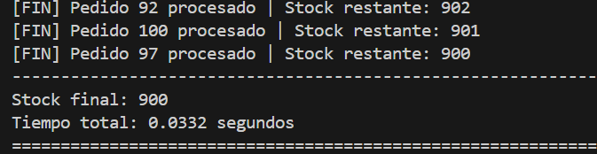
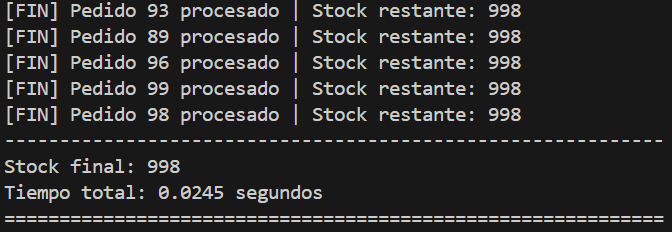
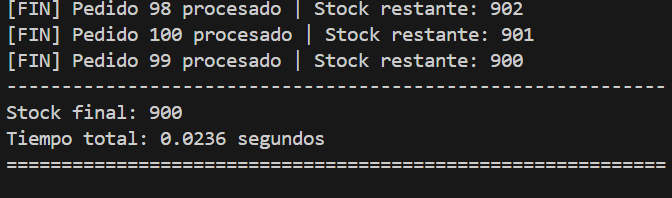
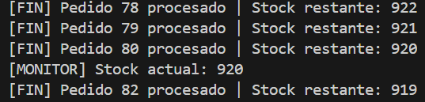

# Procesamiento Concurrente de Pedidos en un Sistema de Inventario.

---

## 1. Introducción

En esta práctica se ha desarrollado un sistema de gestión de inventario que simula el procesamiento concurrente de pedidos en una tienda online. Cada pedido reduce en una unidad el stock disponible, partiendo de un valor inicial de 1000 unidades.

El objetivo principal ha sido analizar el comportamiento de un sistema multihilo cuando varios hilos acceden a un recurso compartido, así como aplicar mecanismos de sincronización para garantizar la consistencia de los datos.

---

## 2. Ejecución sin sincronización (Tarea 4)

En la primera versión, los pedidos se procesan utilizando múltiples hilos sin ningún tipo de mecanismo de sincronización para proteger la variable global `stock_disponible`.

El resultado esperado sería:

```text
Stock final esperado = 1000 - número de pedidos
```

Sin embargo, en las primeras ejecuciones realizadas, el valor final del stock coincidía con el esperado, lo cual podría dar la impresión de que el sistema funciona correctamente.



### Análisis del comportamiento

Este comportamiento se debe a que en Python (CPython) existe un mecanismo llamado GIL (Global Interpreter Lock), que limita la ejecución simultánea de múltiples hilos en operaciones simples. Como consecuencia, en algunos casos no se produce una condición de carrera visible.

No obstante, esto no significa que el código sea seguro. La operación:

```python
stock_disponible -= 1
```

no es atómica, ya que internamente implica:

- Leer el valor actual.
- Modificarlo.
- Escribir el nuevo valor.

Si varios hilos ejecutan esta secuencia de forma concurrente, pueden interferir entre sí.

## 3. Forzando la condición de carrera

Para evidenciar el problema, se ha modificado ligeramente la función introduciendo un pequeño retardo entre la lectura y la escritura del valor:

```python
stock_actual = stock_disponible
time.sleep(0.001)
stock_actual -= 1
stock_disponible = stock_actual
```

Esto aumenta la probabilidad de que varios hilos accedan simultáneamente a la variable compartida.

### Resultado observado

Tras esta modificación, el valor final del stock ya no coincide con el esperado, mostrando inconsistencias.

Esto demuestra la existencia de una condición de carrera, en la que múltiples hilos acceden y modifican un recurso compartido sin control.



## 4. Ejecución con sincronización (Tareas 5 y 6)

Para solucionar el problema, se ha utilizado un mecanismo de exclusión mutua mediante Lock del módulo threading.

La sección crítica se ha protegido de la siguiente forma:
```python
with lock_stock:
    stock_disponible -= 1
```
Esto garantiza que solo un hilo puede acceder a la variable stock_disponible en cada momento.

### Resultado observado

En esta versión, el valor final del stock coincide siempre con el esperado, independientemente del orden de ejecución de los hilos.



## 5. Comparación de resultados (Tarea 7)

| Ejecución                    | Comportamiento               | Resultado  |
| ---------------------------- | ---------------------------- | ---------- |
| Sin sincronización (normal)  | Puede parecer correcto       | No fiable  |
| Sin sincronización (forzada) | Condición de carrera visible | Incorrecto |
| Con sincronización           | Acceso controlado            | Correcto   |

### Explicación
#### Sin sincronización
- Los hilos acceden simultáneamente a la variable compartida.
- Se producen condiciones de carrera.
- El resultado depende del orden de ejecución, que es imprevisible.
#### Con sincronización
- Se aplica exclusión mutua.
- Los accesos se realizan de forma controlada.
- Se garantiza la consistencia del dato.

## 6. Reflexión sobre el hilo principal (Tarea 8)

El hilo principal es responsable de crear y coordinar la ejecución del resto de hilos.

Si el hilo principal realizara una operación bloqueante inmediatamente después de lanzar los hilos, por ejemplo un `sleep` prolongado o una operación pesada, podrían producirse varios efectos negativos:

- La aplicación parecería congelada.
- El usuario percibiría falta de respuesta.
- Se retrasaría la finalización o supervisión de los hilos.

En aplicaciones reales, especialmente con interfaz gráfica, bloquear el hilo principal afecta directamente a la experiencia de usuario, ya que es el encargado de gestionar la interacción.

## 7. Uso del hilo daemon

Se ha implementado un hilo daemon que muestra periódicamente el valor del stock.

Este tipo de hilos:

- No bloquean la finalización del programa.
- Se utilizan para tareas secundarias, como monitorización o logs.
- Se detienen automáticamente cuando finaliza el hilo principal.



## 8. Conclusión

Esta práctica demuestra que:

- La programación multihilo permite procesar múltiples tareas concurrentemente.
- El acceso a recursos compartidos sin sincronización puede provocar inconsistencias.
- La exclusión mutua mediante Lock garantiza la integridad de los datos.
- El comportamiento de los hilos es imprevisible, por lo que no se debe confiar en ejecuciones aparentemente correctas.

Por tanto, en sistemas concurrentes es fundamental no solo crear hilos, sino también controlar adecuadamente el acceso a los recursos compartidos.