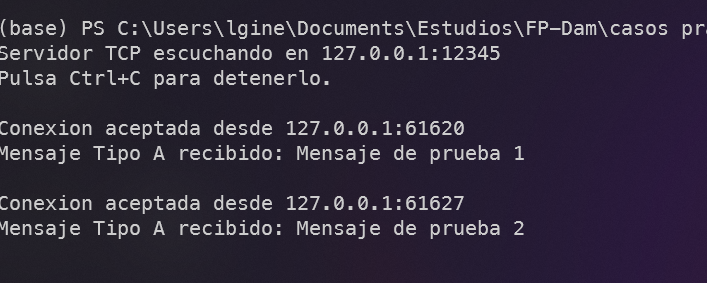
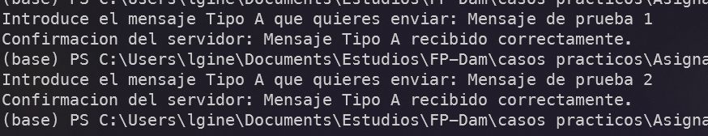
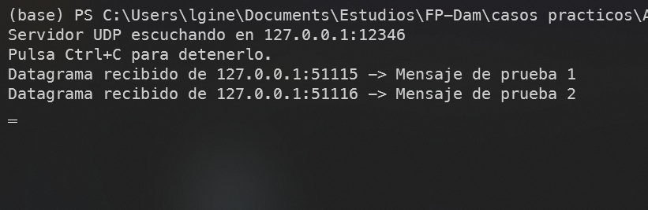
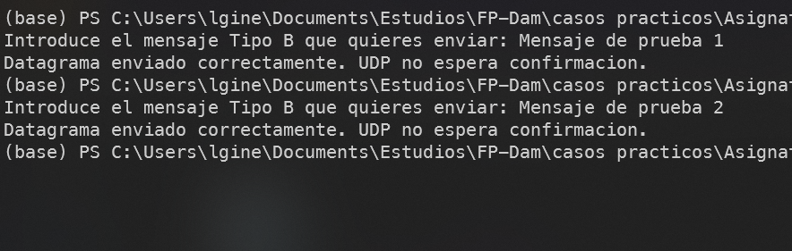
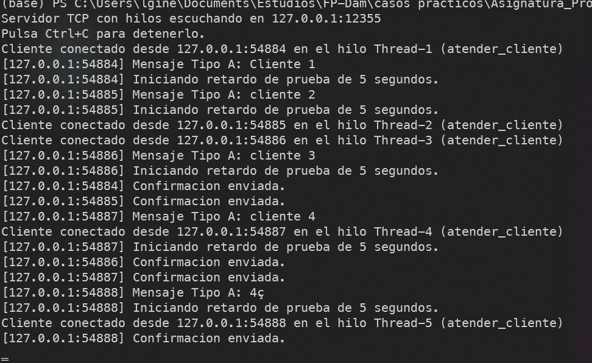
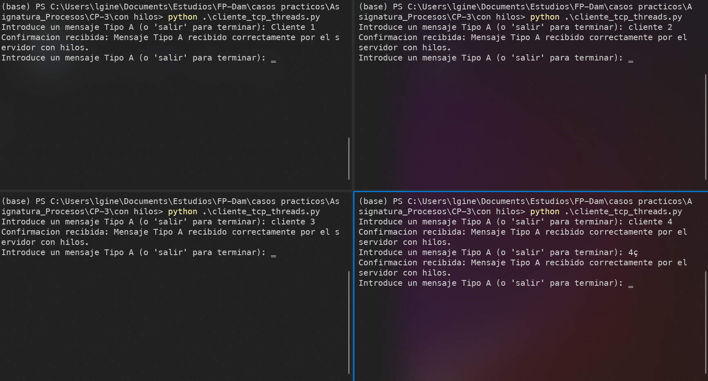
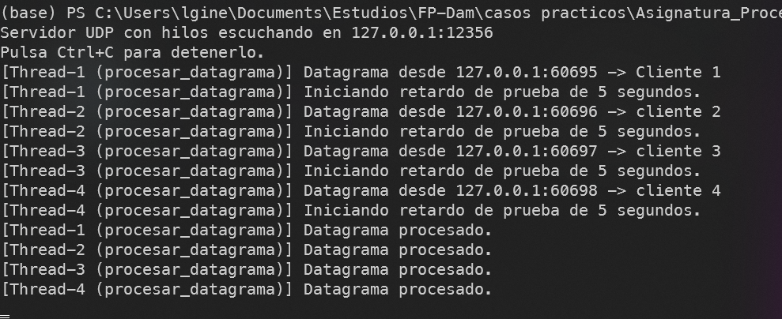
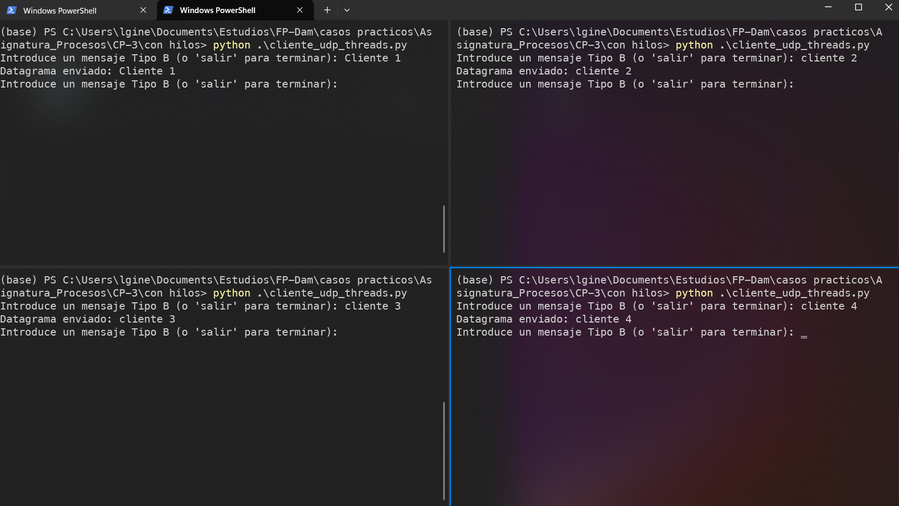

# Sistema de comunicación cliente-servidor hibrido con sockets en Python

## Analisis de resultados

Por Luis Giner Tendero

## 1. Introduccion

En este caso practico he desarrollado un sistema de comunicación cliente-servidor en Python usando dos protocolos distintos segun el tipo de mensaje que pide el enunciado.

Por un lado, para los mensajes urgentes y confirmados (Tipo A) he utilizado TCP, porque en este caso interesa que el mensaje llegue bien, en orden y con una respuesta del servidor.

Por otro lado, para los mensajes de anuncio rápido (Tipo B) he utilizado UDP, porque aquí lo importante es enviar el aviso con rapidez, aunque no exista confirmación de recepción.

Ademas de la versión básica, también he incluido una versión ampliada con hilos para que el servidor pueda atender varias comunicaciones al mismo tiempo.

---

## 2. Archivos entregados

Los archivos de la práctica quedan organizados en dos bloques.

### Versión básica sin hilos

- `solucion sin hilos/servidor_tcp.py`: servidor TCP que escucha conexiones, recibe mensajes Tipo A y devuelve una confirmacion.
- `solucion sin hilos/cliente_tcp.py`: cliente TCP que se conecta al servidor, envía el mensaje y espera la respuesta.
- `solucion sin hilos/servidor_udp.py`: servidor UDP que recibe mensajes Tipo B y los muestra por pantalla.
- `solucion sin hilos/cliente_udp.py`: cliente UDP que envía un datagrama al servidor sin esperar respuesta.

### Versión ampliada con hilos

- `con hilos/servidor_tcp_threads.py`: servidor TCP que crea un hilo para atender a cada cliente.
- `con hilos/cliente_tcp_threads.py`: cliente de prueba para la versión TCP con hilos.
- `con hilos/servidor_udp_threads.py`: servidor UDP que procesa cada mensaje recibido en un hilo independiente.
- `con hilos/cliente_udp_threads.py`: cliente de prueba para la versión UDP con hilos.

---

## 3. Desarrollo de la soluci?n

### 3.1 Servidor TCP

Para la parte TCP he creado un servidor que escucha en `127.0.0.1` y en un puerto concreto. Su funcionamiento es el siguiente:

1. Se queda a la espera de que un cliente se conecte.
2. Cuando acepta la conexión, recibe el mensaje enviado.
3. Muestra ese mensaje por consola para que se vea que ha llegado correctamente.
4. Devuelve una confirmación al cliente.

En la versión sin hilos, el servidor va atendiendo a los clientes de forma consecutiva. Esto cumple el enunciado, porque no era obligatorio usar concurrencia en la versión básica.

### 3.2 Cliente TCP

El cliente TCP pide al usuario que escriba un mensaje de Tipo A. Después se conecta al servidor, envía el texto y se queda esperando la confirmacion. Cuando la recibe, la muestra por pantalla.

Esta parte me parece importante porque es la que demuestra que TCP encaja bien en mensajes urgentes: no solo se envía el contenido, sino que ademas el cliente sabe que el servidor lo ha recibido.

### 3.3 Servidor UDP

En la parte UDP he creado un servidor independiente, usando otro puerto distinto. Este servidor no acepta conexiones como tal, sino que se limita a recibir datagramas.

Cada vez que llega un mensaje:

- lo recibe
- lo decodifica
- lo muestra por pantalla junto con la dirección del cliente

No envía ninguna confirmación, porque precisamente una de las características de UDP es que trabaja sin conexión y sin acuse de recibo.

### 3.4 Cliente UDP

El cliente UDP también pide un mensaje al usuario, pero en este caso lo envia directamente al servidor y termina. No espera respuesta.

Este comportamiento es coherente con lo que pide el enunciado para los anuncios rápidos.

---

## 4. Versión ampliada con hilos

Como mejora, he preparado otra versión en la carpeta `con hilos`.

En el servidor TCP con hilos, cada cliente se atiende en un hilo distinto. Esto permite que varios clientes puedan conectarse casi al mismo tiempo sin tener que esperar a que termine la atención del anterior.

En la prueba del cliente TCP con hilos se tiene que ver que el envío se hace igual que en la versión básica, pero que el servidor puede responder a varias conexiones sin quedarse bloqueado esperando a una sola.

En el servidor UDP con hilos, cada datagrama recibido se procesa en un hilo separado. Aunque UDP ya es un protocolo ligero, esta ampliacion sirve para que el servidor no se bloquee si llegan varios mensajes seguidos.

En el cliente UDP con hilos la forma de uso sigue siendo sencilla, pero la captura debe apoyar que se están lanzando mensajes hacia un servidor que puede procesar varios anuncios de forma concurrente.

Los clientes con hilos realmente siguen siendo clientes sencillos. La mejora importante esta en el lado servidor, que es donde tiene sentido aplicar concurrencia.

---

## 5. Justificacion del uso de TCP para los mensajes Tipo A

He utilizado TCP para los mensajes urgentes y confirmados porque este protocolo ofrece justo lo que pide el enunciado:

- establece una conexión entre cliente y servidor
- garantiza la entrega de los datos
- mantiene el orden de los mensajes
- incorpora control de errores
- permite recibir una confirmación

Si el mensaje representa una tarea importante o una instrucción que no debe perderse, TCP es la mejor opción. En este caso no basta con "intentar enviarlo", sino que hace falta tener la seguridad de que llega correctamente.

---

## 6. Justificacion del uso de UDP para los mensajes Tipo B

He utilizado UDP para los mensajes de anuncio rápido porque aquí la prioridad no es la confirmación, sino la rapidez.

UDP tiene menos sobrecarga que TCP porque:

- no necesita establecer conexión previa
- no controla el orden
- no retransmite paquetes perdidos
- no espera confirmaciones

Por eso resulta adecuado para avisos generales o mensajes informativos donde perder uno puntual no supone un problema grave.

---

## 7. Comparación entre TCP y UDP

| Criterio | TCP | UDP |
| --- | --- | --- |
| Fiabilidad | Alta, garantiza entrega | Baja, no garantiza entrega |
| Orden | Si mantiene el orden | No asegura el orden |
| Confirmación | Si | No |
| Velocidad | Menor, por mayor control | Mayor, por menor sobrecarga |
| Tipo de uso | Mensajes importantes | Avisos rápidos |

En resumen, TCP se adapta mejor a comunicaciones donde importa la seguridad de entrega, mientras que UDP es más adecuado cuando se busca rapidez y sencillez.

Si comparo ambos protocolos por casos de uso, la diferencia se entiende todavía mejor. TCP suele utilizarse en situaciones reales donde perder información o recibirla desordenada ser?a un problema. Por ejemplo, en mensajería entre cliente y servidor, envío de correos, transferencias de archivos, acceso a paginas web o envío de instrucciones importantes dentro de una aplicación. En todos esos casos interesa que los datos lleguen completos y en el orden correcto, aunque se tarde un poco más.

UDP, en cambio, encaja mejor en usos reales donde lo importante es que la información viaje rápido y no pasa nada grave si se pierde algún paquete puntual. Es habitual en streaming en directo, videollamadas, juegos online, difusión de avisos en red local o envío continuo de datos de estado. En este tipo de aplicaciones compensa más recibir la información cuanto antes que detenerse a confirmar cada envío, porque un pequeño fallo aislado suele ser preferible a introducir retraso.

Aplicado a esta práctica, TCP representa bien el caso de una tarea urgente que un usuario tiene que recibir correctamente, mientras que UDP se parece más a un anuncio general rápido, como un aviso interno o una actualización de estado para varios usuarios.

---

## 8. Manejo de errores y aspectos de implementacion

En los programas se ha incluido manejo básico de excepciones con `try-except`, para evitar que el programa falle de forma brusca si ocurre algún problema de conexión.

También se han usado puertos diferentes para TCP y UDP, lo que facilita separar claramente ambos tipos de comunicación y evita conflictos.

Otra decision correcta ha sido trabajar con `localhost`, ya que el enunciado no exigía comunicación entre equipos distintos y para las pruebas locales resulta suficiente.

Ademas, en los servidores se ha controlado la señal `SIGINT`, que es la que se envía normalmente al pulsar `Ctrl+C` en la terminal. Esto permite cerrar el programa de forma más limpia cuando se quiere detener manualmente.

En vez de dejar que el servidor termine mostrando un error brusco por interrupción, se utiliza esa señal para cambiar el estado del servidor y salir del bucle principal de manera ordenada. Me parece una buena solución porque hace que el cierre sea más claro y más profesional.

También es util desde el punto de vista didáctico, ya que permite entender que `Ctrl+C` no "mata" sin más el programa, sino que envía una señal del sistema operativo que Python puede capturar y gestionar.

---

## 9. Pruebas realizadas

Para comprobar que la práctica funciona, he seguido este proceso:

### TCP

1. Ejecutar el servidor TCP.
2. Abrir otra terminal y ejecutar el cliente TCP.
3. Escribir un mensaje.
4. Comprobar que el servidor lo muestra y que el cliente recibe la confirmación.

Con estas capturas se debe ver claramente la relación entre ambas partes: en una terminal aparece el mensaje recibido y en la otra la confirmación devuelta por el servidor.

### UDP

1. Ejecutar el servidor UDP.
2. Abrir otra terminal y ejecutar el cliente UDP.
3. Escribir un mensaje.
4. Comprobar que el servidor recibe el datagrama y lo muestra por pantalla.

Aqui la diferencia importante es que no hay respuesta al cliente. La evidencia de que funciona se observa en la consola del servidor, que recibe y muestra el anuncio enviado.

### Versión con hilos

En la versión ampliada, la prueba consiste en abrir varios clientes seguidos para comprobar que el servidor puede gestionar varias comunicaciones sin quedarse bloqueado en una sola.

---

## 10. Conclusión

Con esta práctica se ve bastante bien la diferencia entre TCP y UDP aplicada a un caso real sencillo.

TCP me ha parecido la opción correcta para los mensajes Tipo A porque asegura la entrega, mantiene el orden y permite confirmación. En cambio, UDP encaja mejor con los mensajes Tipo B porque hace el envío más rápido y ligero.

