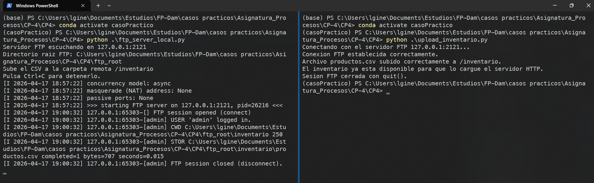
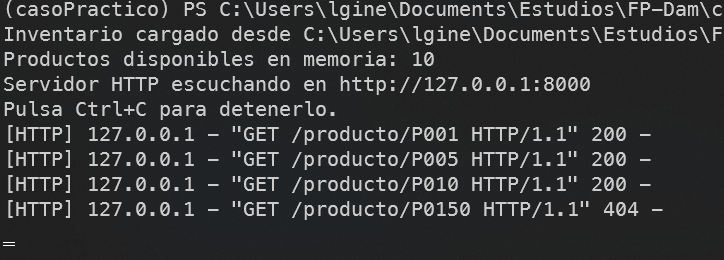
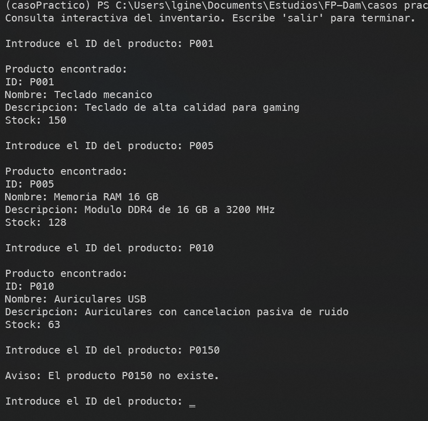
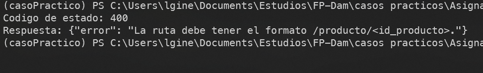

# Sistema básico de gestión de inventario para PYMES

## Analisis de resultados

Por Luis Giner Tendero


## 1. Idea general de la soluci?n

En este caso practico he montado una soluci?n sencilla pero completa para trabajar con tres partes: subida del inventario por FTP, servicio HTTP de consulta y cliente de consola para hacer las peticiones. La idea es que el fichero `productos.csv` se suba primero al entorno FTP local y, despu?s, el servidor HTTP lea ese archivo para responder a las consultas.

Así se ve claramente la relación entre los dos protocolos. FTP sirve para dejar preparado el inventario y HTTP para consultar los productos de una forma más cómoda.

---

## 2. Archivos que forman la práctica

- `productos.csv`: contiene el inventario de ejemplo.
- `ftp_server_local.py`: levanta el servidor FTP local de apoyo.
- `upload_inventario.py`: sube el CSV al directorio remoto `/inventario`.
- `server_inventario.py`: carga el inventario y responde a las consultas HTTP.
- `client_consulta.py`: cliente de consola para buscar productos.
- `prueba_ruta_invalida.py`: comprobacion extra para ver la respuesta `400`.
- `README.md`: explica el orden de ejecución.
- `capturas/README.md`: indica que capturas hay que hacer.

---

## 3. Subida del inventario por FTP

El script `upload_inventario.py` se encarga de conectar con el servidor FTP local usando `ftplib`. Primero comprueba que existe el archivo `productos.csv` y, si todo esta bien, abre la conexión, se autentica con las credenciales previstas y cambia al directorio remoto `/inventario`.

Despu?s sube el fichero con `storbinary` y al final cierra la sesión con `quit()`. Si algo falla, el propio script intenta cerrar la conexión con `close()` para no dejar recursos abiertos.



Con esta parte ya queda el CSV depositado en la raiz FTP que luego usa el servidor HTTP como origen de datos.

---

## 4. Servidor HTTP de consultas

El archivo `server_inventario.py` arranca un servidor HTTP en `127.0.0.1:8000` y carga el CSV desde `ftp_root/inventario/productos.csv`. En este caso la carpeta `ftp_root` hace de raiz del FTP local, así que el inventario que se consulta es el mismo que se ha subido antes.

La ruta que he implementado es:

```text
/producto/<id_producto>
```

Si el producto existe, devuelve un JSON con sus datos y codigo `200`. Si no existe, responde con `404`. Y si la ruta no tiene el formato correcto, devuelve `400`.

La respuesta la construye usando los metodos que pide el enunciado:

- `send_response`
- `send_header`
- `end_headers`
- `wfile.write`

El servidor se queda escuchando con `serve_forever()` hasta que yo lo paro con `Ctrl+C`.



---

## 5. Cliente de consulta

`client_consulta.py` pide al usuario un ID de producto y hace la peticion `GET` al servidor HTTP con `requests`. El cliente esta pensado para ir haciendo consultas seguidas, así que no termina tras la primera peticion, sino que s?gue hasta que escribo `salir`.

Cuando la respuesta es correcta, enseña el producto de forma legible. Si el servidor devuelve `404`, muestra el mensaje de que el producto no existe. Para cualquier otro codigo, enseña un error genérico.

### Consulta de un producto existente

En esta prueba he consultado un producto que s? est? en el inventario, por ejemplo `P001`.



### Consulta de un producto inexistente

También he comprobado el caso contrario, usando un ID que no existe para ver el mensaje de error controlado.


---

## 6. Comprobacion de error 400

Ademas de las pruebas principales, el caso también contempla la respuesta cuando la ruta no esta bien formada. Para eso esta el script `prueba_ruta_invalida.py`, que lanza una peticion a `/producto` sin indicar el identificador.

Esa prueba devuelve `400`, así que me sirve para comprobar que el servidor no acepta rutas incompletas.




---

## 7. Como ejecutar la práctica

Primero hay que instalar las dependencias necesarias:

```bash
pip install requests pyftpdlib
```

Despu?s, el orden que he seguido es este:

```bash
python ftp_server_local.py
python upload_inventario.py
python server_inventario.py
python client_consulta.py
```

El servidor FTP tiene que estar levantado antes de subir el CSV, y el servidor HTTP tiene que arrancarse despu?s de haber subido el archivo.

---

## 8. Lo que me ha parecido más importante

Lo que más he querido cuidar en esta soluci?n ha sido que cada parte haga solo su trabajo:

- FTP se usa para transferir el archivo.
- HTTP se usa para consultar el inventario.
- El cliente de consola solo interpreta respuestas.

También he intentado dejar claro el cierre de conexiones y el manejo de errores, porque en este tipo de pr?cticas no basta con que funcione una vez, sino que la ejecución tiene que quedar ordenada y sin recursos abiertos.

