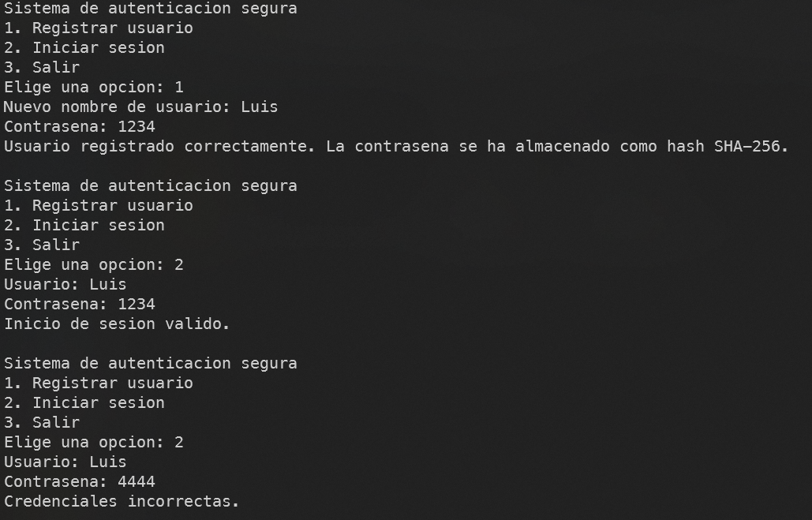
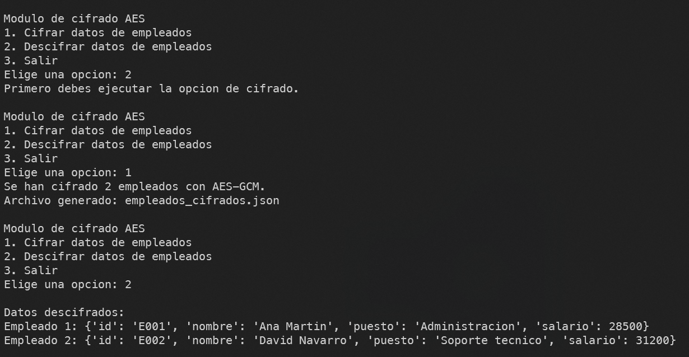
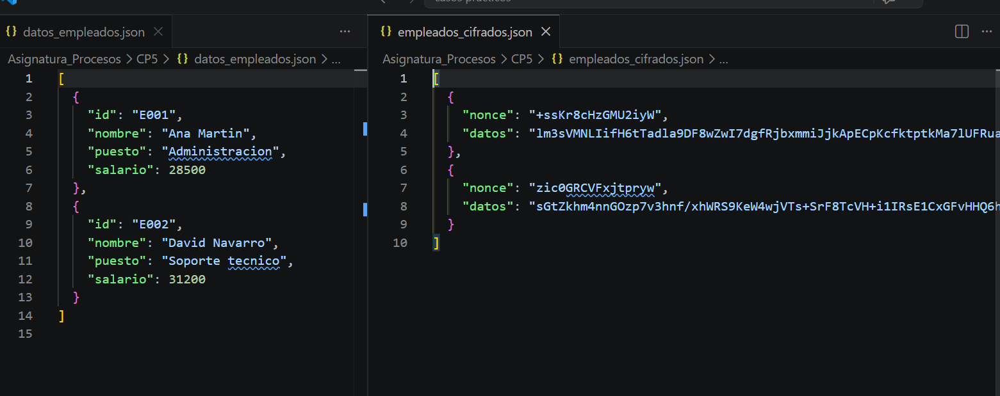
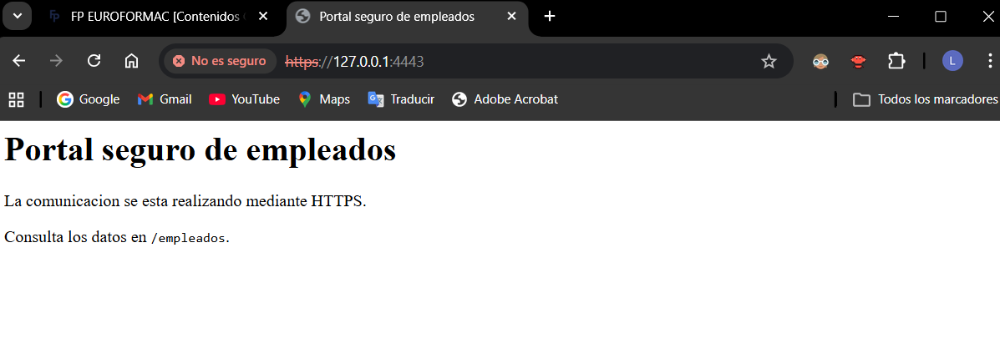
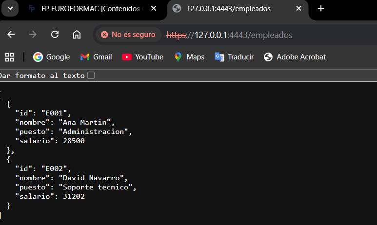
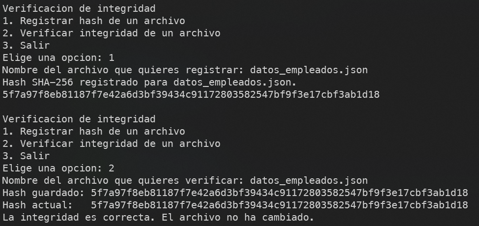
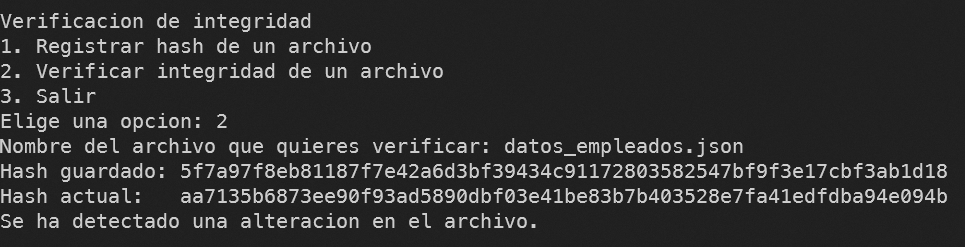

# Aplicación segura para la gestión de empleados

## Análisis de resultados

Por Luis Giner Tendero

## 1. Idea general

En este caso he resuelto la práctica separando la aplicación en cuatro partes, porque el enunciado pide demostrar varios mecanismos de seguridad distintos y así se entiende mejor cada uno:

- autenticación segura con hashes SHA-256
- cifrado y descifrado de datos sensibles con AES-GCM
- publicación del servicio por HTTPS con certificado autofirmado
- verificación de integridad de archivos con SHA-256

He intentado mantener una solución sencilla, pero completa, para que se vea claramente que cada requisito del enunciado esta cubierto con su parte de código y con su prueba correspondiente.

---

## 2. Autenticación segura

Para la autenticación he usado `auth_empleados.py`. Este módulo permite registrar usuarios e iniciar sesión, pero sin guardar nunca la contraseña en texto plano. Cuando se registra un usuario, la contraseña se transforma con SHA-256 y lo que se guarda en `usuarios.json` es solo el hash.

Al hacer login se repite el mismo calculo y se compara el hash introducido con el que ya estaba guardado. Si coinciden, el acceso es correcto; si no, el programa lo rechaza.

Esto cumple la parte del enunciado que pide evitar contraseñas legibles y validar el acceso comparando resúmenes criptogr?ficos.

En la captura se ve el alta de usuario y la comprobación posterior del inicio de sesión. 

---

## 3. Cifrado y descifrado de datos

Para proteger los datos sensibles de los empleados he usado `cifrado_empleados.py`. En este módulo he trabajado con `AES-GCM`, que es un cifrado simétrico adecuado para el caso porque permite cifrar y descifrar con la misma clave y ademas aporta integridad del mensaje.

El programa lee los datos de ejemplo desde `datos_empleados.json`, genera o recupera la clave guardada en `clave_aes.bin` y cifra cada empleado de forma individual. Para cada registro se usa también un `nonce` aleatorio, que evita que dos cifrados iguales produzcan exactamente el mismo resultado.

Después, al descifrar, se recupera el contenido original y se muestra por pantalla para comprobar que el proceso funciona bien de principio a fin.

---

## 4. Comunicación segura mediante HTTPS

La parte de comunicación segura la he resuelto con `servidor_https.py`. El servidor se levanta en local en `https://127.0.0.1:4443` y utiliza un certificado autofirmado que esta dentro de la carpeta `certs`.

Para montar el canal seguro he usado `ssl.SSLContext` y he cargado el certificado y la clave privada con `load_cert_chain`. Así el servidor deja de funcionar como HTTP normal y pasa a trabajar sobre TLS.

También he preparado `probar_https.py` para comprobar el acceso desde cliente y verificar que el endpoint responde correctamente. En la página se ve que la comunicación va por HTTPS y que se puede consultar el contenido sin problema.

### Papel de HTTPS, SSL y TLS

- `HTTPS` es la versión segura de HTTP.
- `SSL/TLS` son los protocolos que protegen el canal de comunicación.
- En la práctica actual, lo habitual es hablar de TLS, aunque muchas veces se siga diciendo SSL por costumbre.

Con esta configuración la información viaja cifrada y es más difícil que un tercero la lea o la manipule durante la transmisión.

---

## 5. Verificaci?n de integridad de archivos

Para la integridad he usado `integridad_archivos.py`. Este módulo calcula el hash SHA-256 de un archivo, lo guarda en `hashes.json` y después permite volver a calcularlo para ver si sigue siendo el mismo.

La idea es sencilla: si el hash actual coincide con el hash guardado, el archivo no ha cambiado. Si no coincide, significa que ha sido modificado.

En la práctica esto se prueba primero registrando un archivo, después verificando que todo coincide y, por ?ltimo, cambiando el contenido para comprobar que el programa detecta la alteración.

Esta captura muestra el caso normal, es decir, cuando el hash coincide y el archivo sigue intacto.

Aquí se ve el caso contrario, cuando el archivo ha cambiado y la comparación ya no da el mismo resultado.

---

## 6. Resumen de ejecución

Para probar la práctica, el orden que he seguido ha sido este:

1. ejecutar `auth_empleados.py` para registrar y probar el acceso
2. ejecutar `cifrado_empleados.py` para cifrar y descifrar los datos
3. arrancar `servidor_https.py` y comprobarlo con `probar_https.py` o desde navegador
4. ejecutar `integridad_archivos.py` para registrar y verificar hashes

Con ese orden se puede comprobar todo lo que pide el enunciado sin mezclar los apartados.

---

## 7. Conclusión

En mi opinión, la práctica queda resuelta porque cada requisito importante del enunciado tiene su módulo, su explicación y su captura de apoyo.

Lo más importante era que no se guardasen contraseñas en claro, que el cifrado fuese simétrico y funcional, que la comunicación se hiciese por HTTPS y que la integridad de los archivos se pudiera comprobar con un hash real. Todo eso queda cubierto con la solución entregada.
